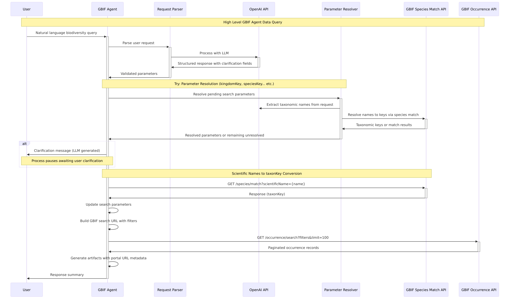

# GBIF Agent

## Parameter Parsing

### [System prompt](src/resources/sysprompt.md)

The GBIF agent system prompt combines its instructional content with [few-shot examples](src/resources/fewshot.json) specific to each entrypoint. This demonstrate parameter extraction for its specific use case, ensuring the LLM understands the nuances and user intent when mapping natural language to GBIF API parameters. 

We use Instructor for structured outputs that conform to response models. Each response has multiple fields:

- `params`: The API parameters extracted from the request
- `unresolved_params`: List of fields that need clarification to continue
- `clarification_needed`: Boolean flag indicating if clarification is required
- `clarification_reason`: Explanation of why clarification is needed
- `artifact_description`: Concise characterization of the retrieved data

This allows the agent to "abort" the request and seek clarification when necessary rather than forcing the model to parse the request with incomplete information.

If there is any valueError raised from the model validations; `instructor` library retries the request and pass the valueError with the LLM context to ensure LLM take the issue with previous response into account. (Max retries - 3)

### Automatic Parameter Resolution

Before seeking user clarification, the system attempts automatic parameter resolution via `resolve_pending_search_parameters()`. This function:

1. **Taxonomic Name Extraction**: Uses LLM to extract taxonomic names from user requests across different ranks (kingdom, phylum, class, order, family, genus, species)
2. **GBIF Key Resolution**: Converts extracted taxonomic names to GBIF keys using the species match API
3. **Field Mapping**: Maps resolved keys to appropriate parameter fields (e.g., familyKey, genusKey, speciesKey)

Only parameters that cannot be automatically resolved are presented to the user for clarification.

### [Validations](src/models/validators.py)

The validations ensures parameter generation accuracy in the LLM response:

#### RequestValidationMixin
- It ensures that all parameter values appear in the original user request
- **Parameter Validation Fields**: Each search parameter validator schema can define set of fields that require explicit mention (keys, IDs, coordinates, etc.)
- **Process**: 
  1. Validates all parameters are valid model fields
  2. Ensures at least one parameter has a value
  3. Checks that critical values (defined in `VALIDATION_FIELDS`) exist in the original request
  4. Prevents hallucinated or inferred values from passing through

#### FacetValidationMixin  
- It validates facet parameters for aggregation queries. We excludes control fields (`facet`, `facetMincount`, `facetMultiselect`, `limit`, `offset`) and raise valueError exception in case LLM tries to put any such field in the generated response
- Provides clear error messages for invalid facet selections

## How Request Inference and API Construction Works
- **Parsing:** Each entrypoint uses a `parse` function with Instructor to extract intent and parameters from the user request into structured response models.
- **Validation:** RequestValidationMixin and specialized validators prevent hallucination and ensure parameter accuracy.
- **Parameter Resolution:** If clarification is needed, the system attempts automatic resolution via:
  - LLM-based taxonomic name extraction from user requests
  - GBIF species match API calls to resolve names to keys
  - Field mapping to appropriate parameter types (familyKey, genusKey, etc.)
- **Scientific Name Resolution:** If scientificName parameters are provided, they're resolved to taxonKey for better search performance.
- **API Construction:** The API URL is constructed using the validated and resolved parameters.
- **Response Handling:**
  - API responses are checked for errors and status codes with detailed logging
  - Results are summarized using LLM-generated response summaries
  - Artifacts are created with metadata including portal URLs for downstream use

## High-level overview of find_occurrence_records entrypoint

## Entrypoint overview
/docs/entrypoints_overview.md

## gbif api usage
/docds/gbif_usage.md