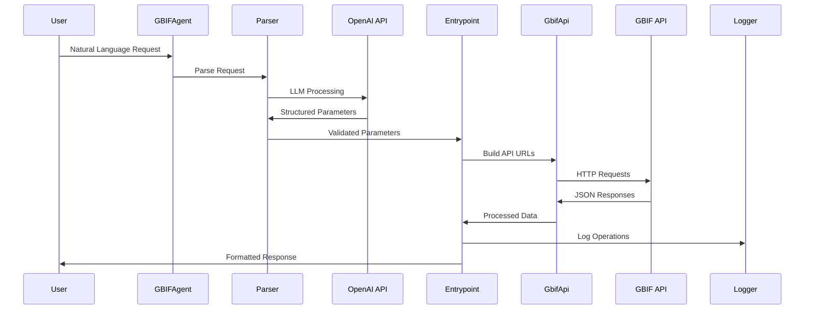

# GBIF Agent Project Architecture

## High-level

## Key Features

- **LLM-Powered Parsing**: Uses OpenAI GPT-4.1 to parse natural language requests into structured API parameters
- **Multiple Entry Points**: 5 different entry points for various GBIF data operations
- **Concurrent API Calls**: Efficiently handles multiple GBIF API endpoints simultaneously
- **Structured Logging**: Comprehensive logging system for debugging and monitoring
- **Type Safety**: Full Pydantic model validation for requests and responses
- **Error Handling**: Robust error handling with graceful degradation
- **Artifact Generation**: Creates structured artifacts with metadata for downstream processing

## Entry Points Overview

1. **find_occurrence_records**: Search for species occurrence records
2. **count_occurrence_records**: Count occurrence records with faceted results
3. **find_species_records**: Search for species records
4. **count_species_records**: Count species records with faceted results
5. **find_species_taxonomic_information**: Retrieve comprehensive taxonomic information 