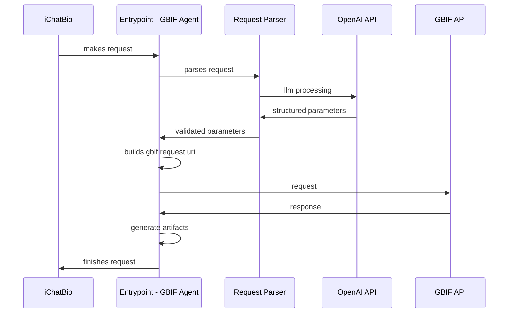

# GBIF Agent Project Architecture

## High-level

## Entry Points Overview

1. **find_occurrence_records**: Search for species occurrence records
2. **count_occurrence_records**: Count occurrence records with faceted results
3. **find_species_records**: Search for species records
4. **count_species_records**: Count species records with faceted results
5. **find_species_taxonomic_information**: Retrieve comprehensive taxonomic information 